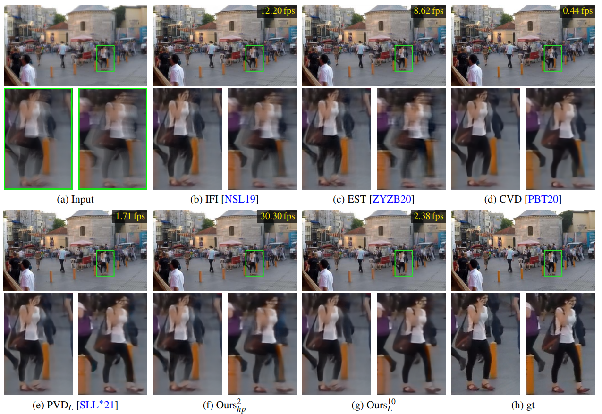

## Real-Time Video Deblurring via Lightweight Motion Compensation<br><sub>Official PyTorch Implementation of the PG 2022 Paper</sub><br><sub> [Project](https://junyonglee.me/projects/RT-VDBLR/) \| [Paper](https://diglib.eg.org/bitstream/handle/10.1111/cgf14667/v41i7pp177-188.pdf?sequence=1&isAllowed=y) \| [arXiv](https://arxiv.org/abs/2205.12634)</sub>

This repo contains training and evaluation code for the following paper:
> [**Real-Time Video Deblurring via Lightweight Motion Compensation**](https://diglib.eg.org/bitstream/handle/10.1111/cgf14667/v41i7pp177-188.pdf?sequence=1&isAllowed=y)<br>
> *[Hyeongseok Son](https://sites.google.com/site/sonhspostech/), *[Junyong Lee](https://junyonglee.me), [Sunghyun Cho](https://www.scho.pe.kr/), and [Seungyong Lee](http://cg.postech.ac.kr/leesy/) (*equal contribution)<br>
> POSTECH<br>
> *Pacific Graphics (**PG**) 2022 (special issue of the Computer Graphics Forum (CGF))*<br>

<p align="left">
  <a href="https://youtu.be/qJNQ76K8TGE">
    
  </a>
</p>

## Getting Started
### Prerequisites
*Tested environment*


#### 1. Environment setup
```bash
$ git clone https://github.com/codeslake/RealTime_VDBLR.git
$ cd RealTime_VDBLR

$ conda create -y --name RealTime_VDBLR python=3.8 && conda activate RealTime_VDBLR

# Install Pytorch (1.12.1 for example,)
$ conda install pytorch torchvision torchaudio cudatoolkit=11.6 -c pytorch -c conda-forge

# Install required dependencies (one of below depend on CUDA version)
# for CUDA10.2
$ ./install/install_CUDA10.2.sh
# for CUDA11.1
$ ./install/install_CUDA11.1.sh
# for CUDA11.3
$ ./install/install_CUDA11.3.sh
# for CUDA11.6
$ ./install/install_CUDA11.6.sh
```

#### 2. Datasets
Download and unzip datasets under `[DATASET_ROOT]`:
* Su *et al.*'s DVD dataset: [Google Drive](https://drive.google.com/open?id=1OY3mHiDbhCfVmwPA_gqckRDp4Ekryh7d&authuser=codeslake%40gmail.com&usp=drive_fs) \| [Dropbox](https://www.dropbox.com/s/8daduee9igqx5cw/DVD.zip?dl=1) 
* Nah *et al.*'s GoPro dataset: [Google Drive](https://drive.google.com/open?id=1O_VHISCRlff0gmfIqBnAr0RupvVUrJ9j&authuser=codeslake%40gmail.com&usp=drive_fs) \| [Dropbox](https://www.dropbox.com/s/5ese6qtbwy7fsoh/nah.zip?dl=1)
* Nah *et al.*'s REDS dataset: [download script](https://gist.github.com/SeungjunNah/b10d369b92840cb8dd2118dd4f41d643)

```
[DATASET_ROOT]
    ├── train_DVD
    ├── test_DVD
    ├── train_nah
    ├── test_nah
    └── REDS
        └── reds_lmdb
            ├── reds_info_train.pkl
            ├── reds_info_valid.pkl
            ├── reds_train
            ├── reds_train_gt
            ├── reds_valid
            └── reds_valid_gt
```

> `[DATASET_ROOT]` can be modified with [`config.data_offset`](https://github.com/codeslake/RealTime_VDBLR/blob/main/configs/config.py#L44) in `./configs/config.py`.

#### 3. Pre-trained models
Download and unzip pretrained weights ([Google Drive](https://drive.google.com/drive/folders/1--m4c8rF1UmEdyu2AIM3DB-z5_03ZZxY?usp=sharing) \| [Dropbox](https://www.dropbox.com/sh/k1j7kdk7qyq04jg/AADNCY0guxTqZgL6sKAVyKcTa?dl=1)) under `./ckpt/`:

```
RealTime_VDBLR
├── ...
├── ckpt
│   ├── liteFlowNet.pytorch
│   ├── MTU#_DVD.pytorch
│   ├── MTU#_GoPro.pytorch
│   ├── MTU#_REDS.pytorch
│   └── ...
└── ...
```

## Testing models of PG 2022
*For PSNRs and SSIMs reported in the paper, we use the approach of [Koehler *et al.*](https://webdav.tuebingen.mpg.de/pixel/benchmark4camerashake/src_files/Pdf/Koehler_ECCV2012_Benchmark.pdf)
following [Su *et al.*](https://openaccess.thecvf.com/content_cvpr_2017/papers/Su_Deep_Video_Deblurring_CVPR_2017_paper.pdf),
that first aligns two images using global translation to represent the ambiguity in the pixel location caused by blur.*<br>
***Refer [here](https://github.com/codeslake/RealTime_VDBLR/tree/main/evaluation_matlab) for the evaluation code.***

```shell
# [n]-stack MTUs evaluationed on [DVD|GoPro|REDS] datasets
./script_eval/MTU[n]_[dataset].py

# for 2-stack amp model,
./script_eval/MTU2_amp_[dataset].py

# for 10-stack large model,
./script_eval/MTU10_L_[dataset].py

# 4-stack model on REDS dataset, for example,
./script_eval/MTU4_REDS.py
```

> Testing results will be saved in `[LOG_ROOT]/PG2022_RealTime_VDBLR/[mode]/result/eval/[mode]_[epoch]/[data]/`.

> `[LOG_ROOT]` can be modified with [`config.log_offset`](https://github.com/codeslake/RealTime_VDBLR/blob/main/configs/config.py#L57) in `./configs/config.py`.


#### options
* `--data`: The name of a dataset to evaluate: `DVD` | `nah` | `REDS`. Default: `DVD`
    * The data structure can be modified in the function [`set_eval_path(..)`](https://github.com/codeslake/RealTime_VDBLR/blob/main/configs/config.py#L139-170) in `./configs/config.py`.

## Wiki
* [Logging](https://github.com/codeslake/RealTime_VDBLR/wiki/Log-Details)
* [Training and testing details](https://github.com/codeslake/RealTime_VDBLR/wiki/Training-&-Testing-Details)

## Contact
Open an issue for any inquiries.
You may also have contact with [sonhs@postech.ac.kr](mailto:sonhs@postech.ac.kr) or [junyonglee@postech.ac.kr](mailto:junyonglee@postech.ac.kr)

## License
<br>
This software is being made available under the terms in the [LICENSE](LICENSE) file.
Any exemptions to these terms require a license from the Pohang University of Science and Technology.

## Citation
If you find this code useful, please consider citing:
```
@InProceedings{Son2022RTDeblur,
    author    = {Hyeongseok Son and Junyong Lee and Sunghyun Cho and Seungyong Lee},
    title     = {Real-Time Video Deblurring via Lightweight Motion Compensation},
    booktitle = {Pacific Graphics},
    year      = {2022},
}
```

